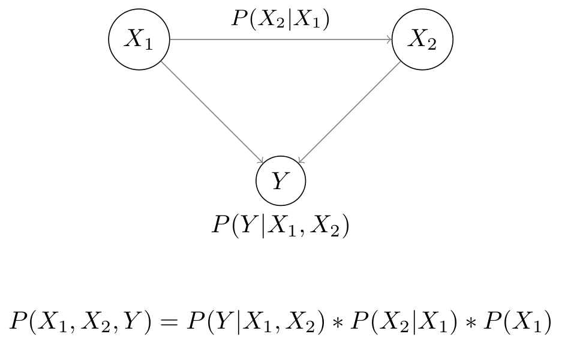
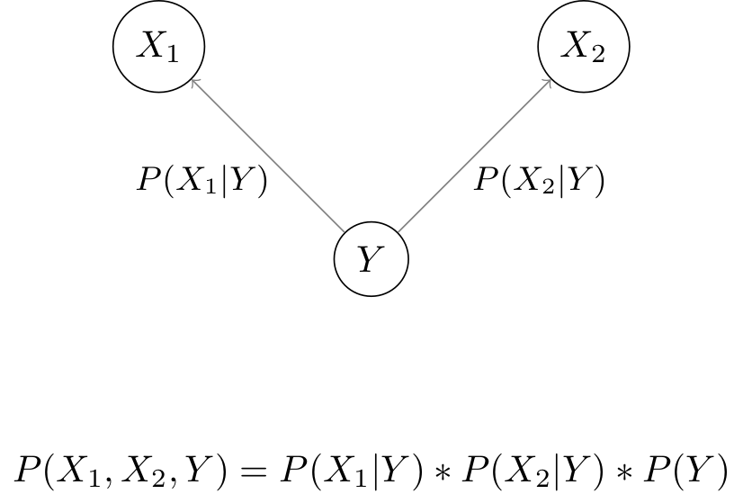

# Bayesian Network Classifiers

## Bayesian Network
Let's assume a classification problem with features `X1` and `X2` and label `Y`. Both features directly effect label `Y` and feature `X1` effects `X2`.

<p align="center">

</p>

## Naive Bayes

### Concept
* Compute the joint probability `P(X1,X2,Y)`. Use the joint probability to compute `P(Y|X1,X2)`.
* Fit: Compute `P(Y)`, `P(X1|Y)` and `P(X2|Y)`.
* Predict: Use `P(Y)`, `P(X1|Y)` and `P(X2|Y)` to compute `P(Y|X1,X2)`.

### Conditional independence

#### Independent
|X1|X2|Y|
|-|-|-|
|1|0|1|
|1|1|1|

Observe Y=1
|X1|X2|Y|
|-|-|-|
|?|?|1|
|?|?|1|

```Python
P(X2=0,X1=1|Y=1) = 0.5
```

Observe Y=1 and X1=1
|X1|X2|Y|
|-|-|-|
|1|?|1|
|1|?|1|

```Python
P(X2=0|X1=1,Y=1) = 0.5
```

#### Independent
|X1|X2|Y|
|-|-|-|
|1|0|1|
|0|1|1|

Observe Y=1
|X1|X2|Y|
|-|-|-|
|?|?|1|
|?|?|1|

```Python
P(X2=0,X1=1|Y=1) = 0.5
```

Observe Y=1 and X1=1
|X1|X2|Y|
|-|-|-|
|1|?|1|
|-|-|-|

```Python
P(X2=0|X1=1,Y=1) = 1.0
```
### Derivation
Compute the joint probability by using the chain rule
``` Python
P(X1,X2,Y) = P(Y|X1,X2) * P(X2|X1) * P(X1)
```

Rewrite the joint probability using the Bayes’ theorem
```Python
# E1
P(Y|X1,X2) = P(X1,X2,Y) / P(X2|X1) * P(X1)
           = P(X1,X2,Y) / P(X1,X2)
           = P(X1,X2,Y) / Z
```

First only look at the numerator: `P(X1,X2,Y)`

``` Python
# E2
P(X1,X2,Y) = P(X1|X2,Y) * P(X2,Y)           
             # Chain rule of probability
           = P(X1|X2,Y) * P(X2|Y) * P(Y) 
```

It is assumed that `X1` and `X2` are conditionally independent given `Y`:
``` Python
# E3
P(X1|X2,Y) = P(X1|Y)
```
That means `X2` contributes nothing to the certainity of `X1`.

Insert E3 into E2:
``` Python
# E4:
P(X1,X2,Y) = P(X1|Y) * P(X2|Y) * P(Y)
```

<p align="center">

</p>

Plug E4 into E1:

``` Python
P(Y|X1,X2) = P(X1,X2,Y) / Z
           = P(X1|Y) * P(X2|Y) * P(Y) / Z
```

Compute `Z`
``` Python
Z = P(X1, X2)
  # Compute the marginal probability using E4
  = P(X1|Y=0) * P(X2|Y=0) * P(Y=0) + P(X1|Y=1) * P(X2|Y=1) * P(Y=1)
```

### Numerical Example
|X|Y|
|-|-|
|1|1|
|1|0|
|1|1|
|0|0|


For the given example we can compute the following probabilities:
```
P(Y=0) = 1/4
P(Y=1) = 3/4
P(X=0|Y=0) = 1/2
P(X=0|Y=1) = 0
P(X=1|Y=0) = 1/2
P(X=1|Y=1) = 1
```

``` Python
P(Y|X1) = 1/Z * P(Y) * P(X1|Y)
Z = P(X1) = P(Y=0) * P(X1|Y=0) + P(Y=1) * P(X1|Y=1)
```

Let's assume we want to compute `P(Y=1|X=1)`


``` Python
P(Y=1|X=1) = 1/Z * P(Y=1) * P(X=1|Y=1)
           = 1/Z * 2/4 * 1
           = 1/Z * 1/2

Z = P(X=1) = P(X=1|Y=0) * P(Y=0) + P(X=1|Y=1) * P(Y=1)
           = 2/4 * 1 + 2/4 * 1/2
           = 3/4

P(Y=1|X=1) = 1/(3/4) * 1/2
           = 2/3
```

## Scikit-learn
Explanation of the Naive Bayes classifier implementation in scikit-learn for categorical features.

### Example
|X|Y|
|-|-|
|1|1|
|1|0|
|1|1|
|0|0|

### Fit
Y|Num X=0|Num X=1| Num X=0 + Num X=1|
-|-|-|-|
0|1|1|2|
1|0|2|2|

``` Python
cat_count[0] = [1, 1], # Y=0
cat_count[1] = [0, 2]  # Y=1
```

``` Python
class_count[0] = 2 # Y=0, Num X=0 + Num X=1
class_count[1] = 2 # Y=1, Num X=0 + Num X=1
```

Compute `P(X|Y) = cat_count/class_count`
```Python
# Use 1e-10 to avoid log(0)
feature_prob[0][0] = [0.5,   0.5] # P(X=0|Y=0), P(X=1|Y=0)
feature_prob[0][1] = [1e-10, 1.0] # P(X=0|Y=1), P(X=1|Y=1)

feature_log_prob[0][0] = [log(0.5),   log(0.5)]
feature_log_prob[0][1] = [log(1e-10), log(1.0)]
```

### Predict
Assign `P(X|Y)` to each instance, in case of multiple features multipy the probabilties `jll = P(X1|Y) * P(X2|Y)`
``` Python
joint_log_likelihood[0][0] = [log(0.5), log(1.0)]   # P(X=1|Y=0), P(X=1|Y=1)
joint_log_likelihood[0][1] = [log(0.5), log(1.0)]   # P(X=1|Y=0), P(X=1|Y=1)
joint_log_likelihood[0][2] = [log(0.5), log(1.0)]   # P(X=1|Y=0), P(X=1|Y=1)
joint_log_likelihood[0][3] = [log(0.5), log(1e-10)] # P(X=0|Y=0), P(X=0|Y=1)
```

Compute `P(Y)=num_Y_1/num_Y`
``` Python
class_prior = 2/4 = 1/2
```
Compute `P(X|Y) * P(Y)`
``` Python

joint_log_likelihood[0][0] = [log(0.5/2), log(1.0/2)]  
joint_log_likelihood[0][1] = [log(0.5/2), log(1.0/2)]
joint_log_likelihood[0][2] = [log(0.5/2), log(1.0/2)]   
joint_log_likelihood[0][3] = [log(0.5/2), log(1e-10/2)
```

Compute `Z`
``` Python
# P(X=1) = P(X=1|Y=0) * P(Y=0) + P(X=1|Y=1) * P(Y=1) = 3/4
log_prob_x[0] = log(exp(log(0.5/2)) + exp(log(1.0/2))) = log(0.75)
log_prob_x[1] = log(exp(log(0.5/2)) + exp(log(1.0/2))) = log(0.75)
log_prob_x[2] = log(exp(log(0.5/2)) + exp(log(1.0/2))) = log(0.75)
log_prob_x[3] = log(exp(log(0.5/2)) + exp(log(1e-10/2))) = log(0.25)
```

Compute `P(X|Y) * P(Y) * 1/Z`
Same as `logP(X|Y) = log(0.5/2) - log(0.75) = log(0.5/2 * 1/0.75)` 
``` Python
log_prob[0][0] = [log(0.5/2 * 1/0.75), log(1.0/2 * 1/0.75)]
log_prob[0][1] = [log(0.5/2 * 1/0.75), log(1.0/2 * 1/0.75)]
log_prob[0][2] = [log(0.5/2 * 1/0.75), log(1.0/2 * 1/0.75)]
log_prob[0][3] = [log(0.5/2 * 1/0.25), log(1e-10/2 * 1/0.25)]
```

Convert `log_prob` to `prob`
``` Python
prob[0][0] = [0.5/2 * 1/0.75, 1.0/2 * 1/0.75]
prob[0][1] = [0.5/2 * 1/0.75, 1.0/2 * 1/0.75]
prob[0][2] = [0.5/2 * 1/0.75, 1.0/2 * 1/0.75]
prob[0][3] = [0.5/2 * 1/0.25, 1e-10/2 * 1/0.25]
```