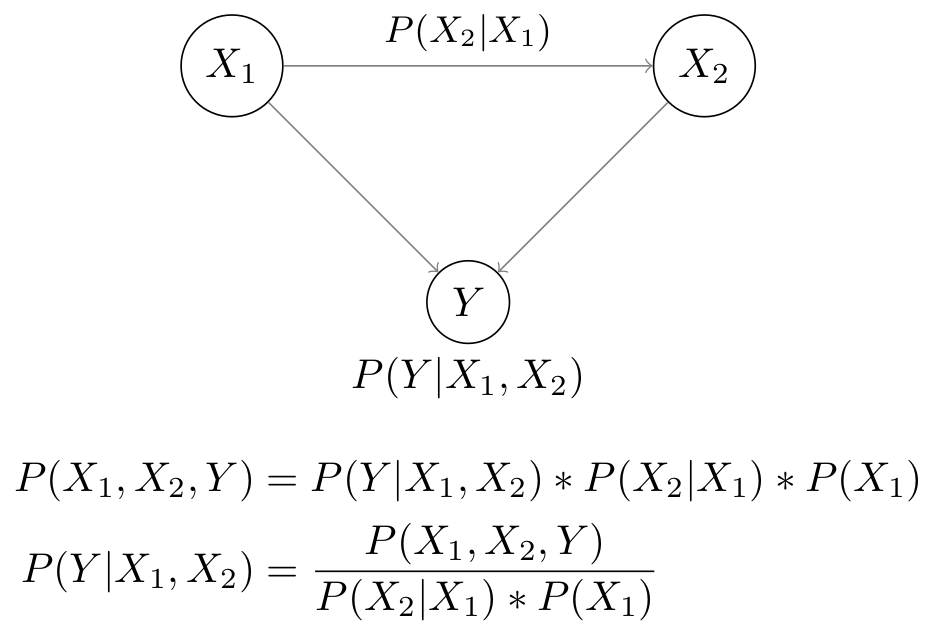
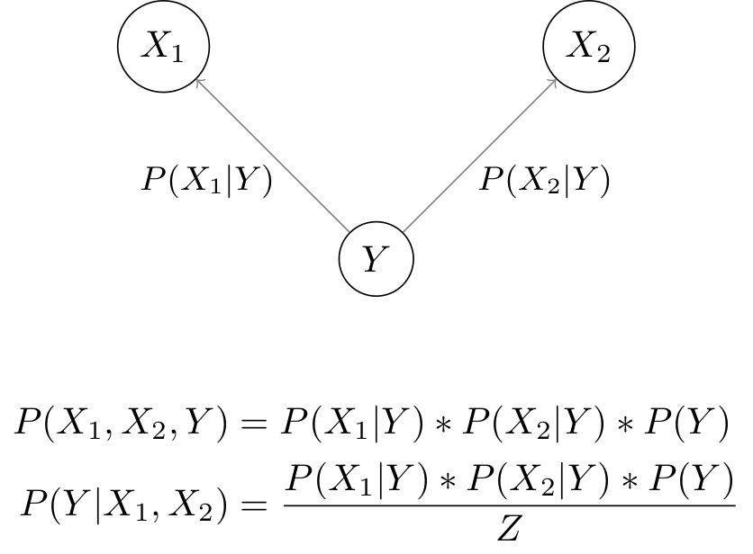

# Bayesian Network Classifiers

## Bayesian Network
Let's assume a classification problems with features `X1` and `X2` and label `Y`. Both features directly effect label `Y` and feature `X1` effects `X2`.

The joint probability `P(X1,X2,Y)`can be computed using the chain rule:
```
P(X1,X2,Y) = P(Y|X1,X2) * P(X2|X1) * P(X1)
```

<p align="center">

</p>

## Naive Bayes

### Concept
* Compute the joint probability `P(X1,X2,Y)`. Use the joint probability to compute `P(Y|X1,X2)`.
* Fit: Compute `P(Y)`, `P(X1|Y)` and `P(X2|Y)`.
* Predict: Use `P(Y)`, `P(X1|Y)` and `P(X2|Y)` to compute `P(Y|X1,X2)`.

### Derivation
Compute the joint probability by using the chain rule
``` Python
P(X1,X2,Y) = P(Y|X1,X2) * P(X2|X1) * P(X1)
```

Rewrite the joint probability using the Bayes theorem
```Python
# E1
P(Y|X1,X2) = P(X1,X2,Y) / P(X2|X1) * P(X1)
           = P(X1,X2,Y) / P(X1,X2)
           = P(X1,X2,Y) / Z
```

First only look at the numerator: `P(X1,X2,Y)`

``` Python
# E2
P(X1,X2,Y) = P(X1|X2,Y) * P(X2,Y)           
             # Chain rule of probability
           = P(X1|X2,Y) * P(X2|Y) * P(Y) 
```

It is assumed that `X1` and `X2` are conditionally independent given `Y`:
``` Python
# E3
P(X1|X2,Y) = P(X1|Y)
```
That means `X2` contributes nothing to the certainity of `X1`.

Insert E3 into E2:
``` Python
# E4:
P(X1,X2,Y) = P(X1|Y) * P(X2|Y) * P(Y)
```

<p align="center">

</p>

Plug E4 into E1:

``` Python
P(Y|X1,X2) = P(X1,X2,Y) / Z
           = P(X1|Y) * P(X2|Y) * P(Y) / Z
```

Compute `Z`
``` Python
Z = P(X1, X2)
  # Compute the marginal probability using E4
  = P(X1|Y=0) * P(X2|Y=0) * P(Y=0) + P(X1|Y=1) * P(X2|Y=1) * P(Y=1)
```

# Numerical Example
|X|Y|
|-|-|
|1|1|
|1|0|
|1|1|
|0|0|


For the given example we can compute the following probabilities:
```
P(Y=0) = 1/4
P(Y=1) = 3/4
P(X=0|Y=0) = 1/2
P(X=0|Y=1) = 0
P(X=1|Y=0) = 1/2
P(X=1|Y=1) = 1
```

``` Python
P(Y|X1) = 1/Z * P(Y) * P(X1|Y)
Z = P(X1) = P(Y=0) * P(X1|Y=0) + P(Y=1) * P(X1|Y=1)
```

Let's assume we want to compute `P(Y=1|X=1)`


``` Python
P(Y=1|X=1) = 1/Z * P(Y=1) * P(X=1|Y=1)
           = 1/Z * 2/4 * 1
           = 1/Z * 1/2

Z = P(X=1) = P(X=1|Y=0) * P(Y=0) + P(X=1|Y=1) * P(Y=1)
           = 2/4 * 1 + 2/4 * 1/2
           = 3/4

P(Y=1|X=1) = 1/(3/4) * 1/2
           = 2/3
```