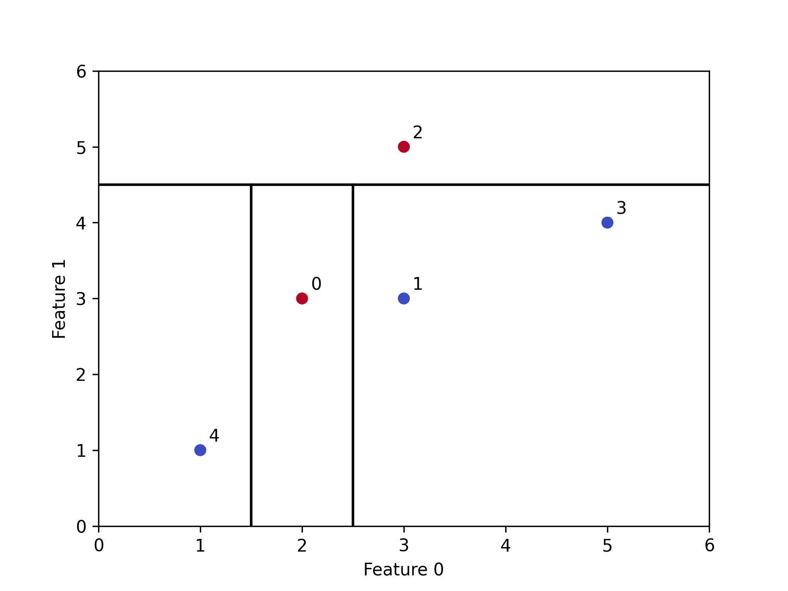
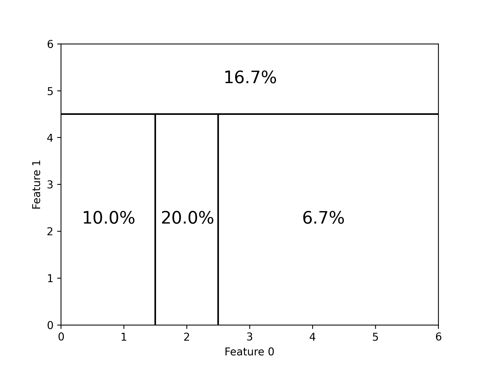

# Decision Tree

## Training Data Inference
It's possible to infer the training data just by looking at the nodes of a decision tree.

Example:

| Feature 0 | Feature 1 | Label |
|-----------|-----------|-------|
|   2       |   3       |   1   |
|   3       |   3       |   0   |
|   3       |   5       |   1   |
|   5       |   4       |   0   |
|   1       |   1       |   0   |

Using this example XGBoost generates the decision tree:
``` Python
[feature_1_value<4.5]           
├── [feature_0_value<2.5]       # id = {0, 1, 3, 4}
│   ├── [feature_0_value<1.5]   # id = {0, 4}
│   │   ├── leaf=-2.0           # id = {4}    label = 0
│   │   └── leaf=2.0            # id = {0}    label = 1
│   └── leaf=-2.0               # id = {1, 3} label = 0
└── leaf=2.0                    # id = {2}    label = 1
```

The thresholds of the decision tree can be plotted:


The probability for guessing both feature values under the assumption that the features are independent and uniformly distributed is shown in the following diagram:


The smaller the rectangle, the more likely it is to infer both feature values.