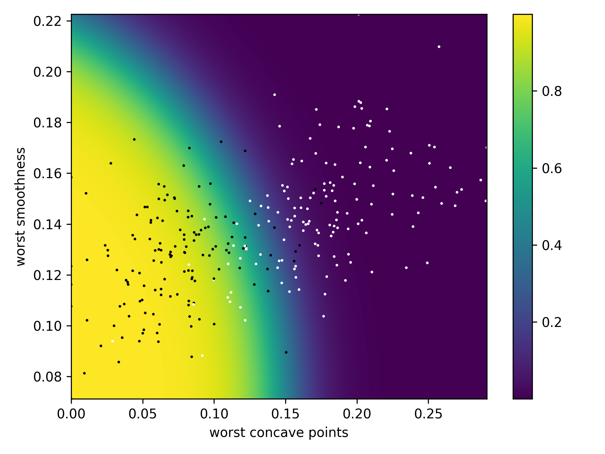

# Inductive Bias

## Dataset
For the analysis of different machine learning models and their inductive bias, the Breast Cancer Wisconsin Dataset is used. A subset of two features has been chosen: `worst_concave_point` and `worst smoothness`.

The histograms below show the distribution of the feature values. The Naive Bayes model assumes that the feature are distributed according to a Gaussian distribution. The real distribution of the features doesn't follow a Gaussian distribution (blue line).

## Models
The conditional probability distributions of different machine learning models are plotted below.
<table>
<tr>
    <td>Model</td>
    <td>Neural Network</td>
    <td>XGBoost</td>
    <td>Naive Bayes</td>
</tr>
<tr>
    <td>Validation Loss</td>
    <td>0.1726</td>
    <td>0.2708</td>
    <td>0.2444</td>
</tr>
<tr>
    <td></td>
    <td></td>
    <td></td>
    <td></td>
</tr>
</table>

