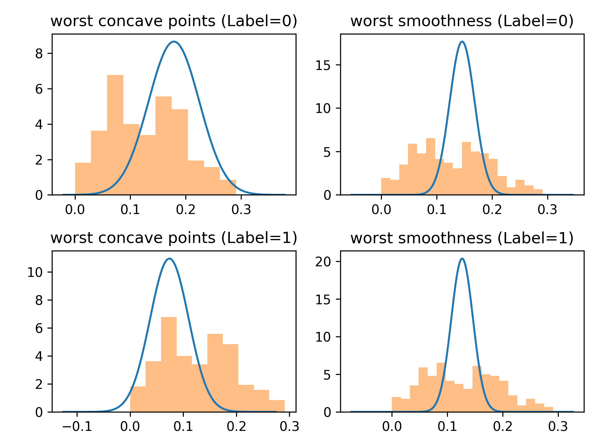
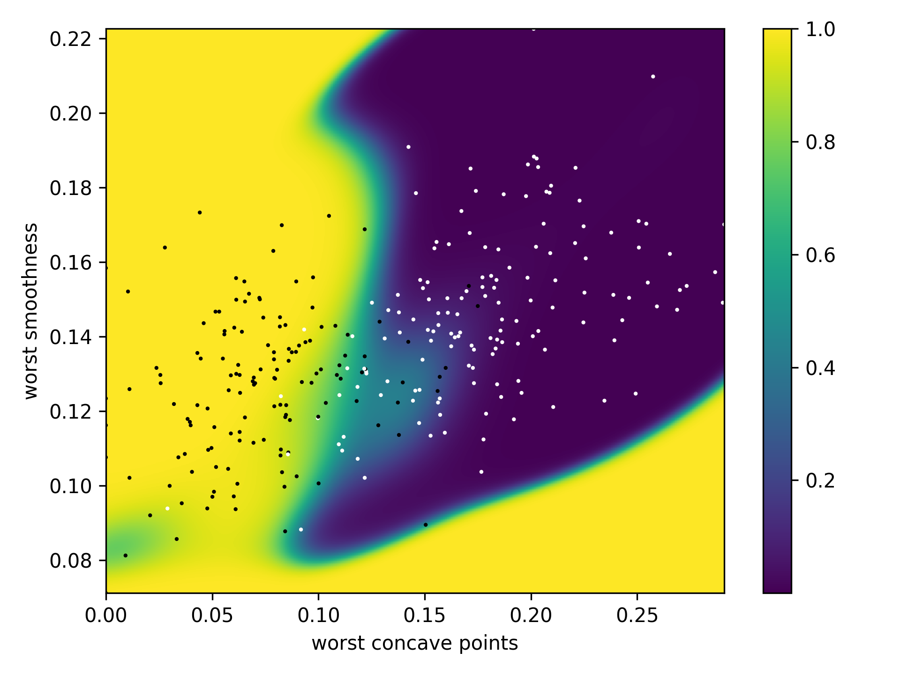
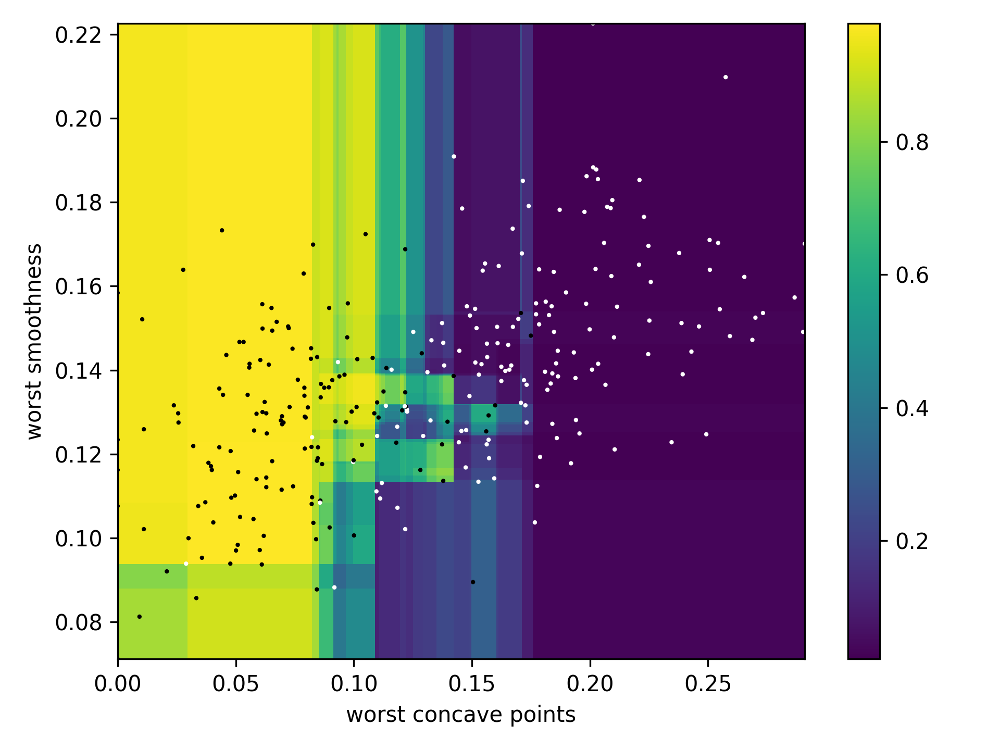
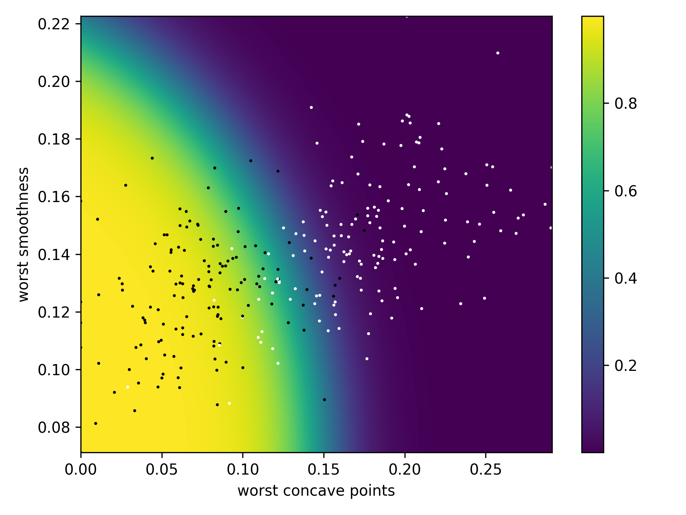
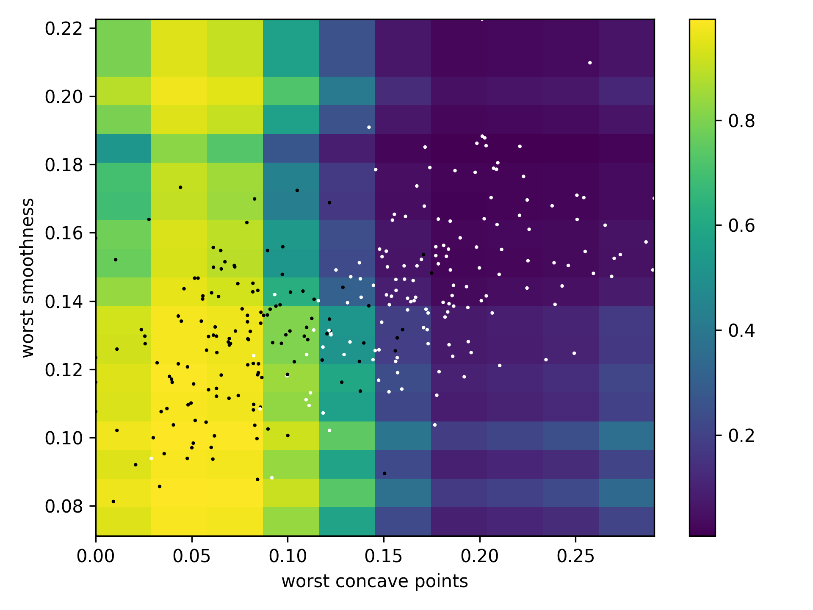

# Inductive Bias

## Dataset
For the analysis of different machine learning models and their inductive bias, the Breast Cancer Wisconsin Dataset is used. A subset of two features has been chosen: `worst_concave_point` and `worst smoothness`.

There are two options how we can fit a Naive Bayes model:
* Option 1: We can assume that the features are distributed according to a Gaussian distribution (blue line) and use this distribution as input of the model.
* Option 2: We can take the histogram (orange) as input of the model. 

## Models
The conditional probability distributions of different machine learning models are plotted below.
<table>
<tr>
    <td>Model</td>
    <td>Probability Distribution</td>
    <td>Validation Loss</td>
</tr>
<tr>
    <td>Neural Network</td>
    <td></td>
    <td>0.1726</td>
</tr>
<tr>
    <td>XGBoost</td>
    <td></td>
    <td>0.2708</td>
</tr>
<tr>
    <td>Naive Bayes – Gaussian</td>
    <td></td>
    <td>0.2444</td>
</tr>
<tr>
    <td>Naive Bayes – Categorical (8 bins)</td>
    <td></td>
    <td>0.2388</td>
</tr>
</table>

