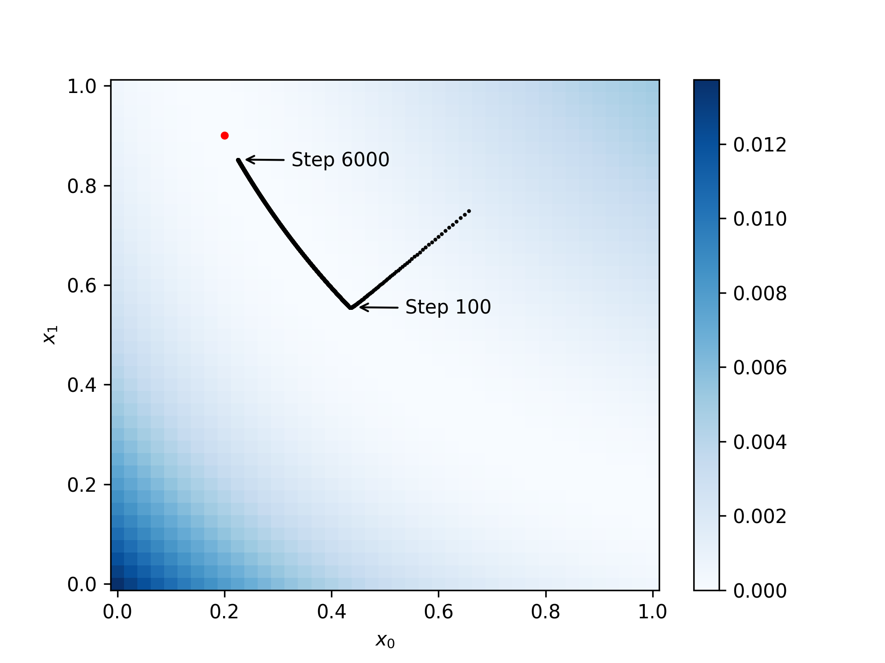

# Training Data Inference
This project investigates whether the training data of a neural network can be infered from the gradients based on a method
described in [Deep Leakage from Gradients](https://arxiv.org/pdf/1906.08935.pdf).

The module `compute_gradients.py` applies the method described in the paper on a fully connected neural network with one hidden layer:
```Python
logits = dot(inputs, weights) + bias
```
For the analysis we assume a batch size of 2 and that the labels are known.

## Description of the method
The neural network under investigation uses binary cross entropy as a loss function L<sub>c</sub> (c stands for classifaction). During training the weights of the model are being updated using the gradient ∇<sub>x</sub>L<sub>c</sub>. The goal is to infere the training data from the gradient ∇<sub>x</sub>L<sub>c</sub>.

In order to infer the training data, the fake inputs x'<sub>1</sub> and x'<sub>2</sub> are generated. For these fake inputs the fake gradient  ∇<sub>x'</sub>L<sub>c</sub> is computed. 

The loss function L<sub>r</sub> (r stands for regression) compares the true gradient with the fake gradient. The gradient of this function wrt x' is computed and the fake input is updated with this gradient.
<p align="center">

</p>

The module `render_loss.py` renders the loss function L<sub>r</sub>.

## Conclusions
* When applied on a fully connected neural network, the method decribed in the paper [Deep Leakage from Gradients](https://arxiv.org/pdf/1906.08935.pdf) only converges fast for a batch size of 1 and 1 feature. For bigger batch sizes convergence is slow. An example for a batch size of 2 is shown in the figure below.
* The reason for the slow convergence is that the loss function is very flat. The flatter the loss function the smaller the gradients, the longer it takes to converge.
* A flat loss function means that there are many batches with different input values where the fake gradient is almost the same as the true gradient.

<p align="center">

</p>